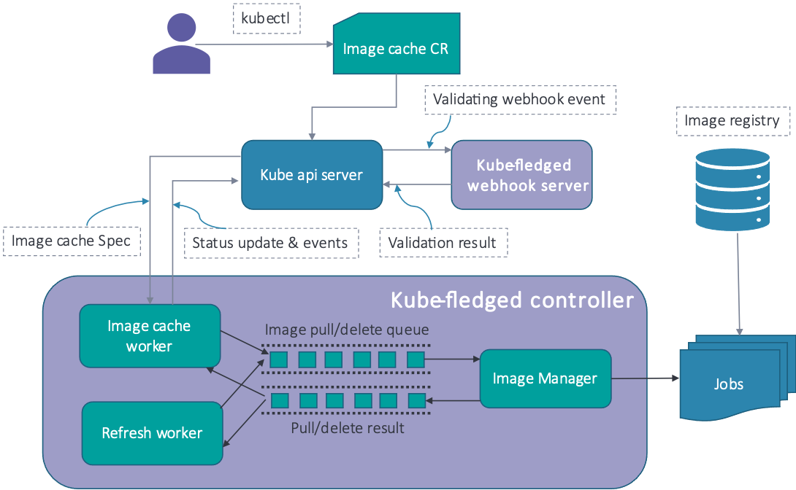

# 1. Problem Statement
When a Pod is successfully scheduled to a k8s worker node, the container images required for the Pod are pulled down from a image registry. Depending on the size of the image and network latency, the image pull will consume considerable time duration. Ultimately this increases the time taken to start the containers and Pod reaching ready status.

There are several use cases where Pods are expected to be up and running instantly. The considerable time taken in pulling the container image becomes a major bottleneck in achieving this. And there are use cases where the connectivity to the image registry might not be available all the time (E.g. IoT/Edge computing where the Edge nodes are running on a moving Cruise vessel).

If images need to be pulled from private registry and everyone cannot be granted access to pull images from this
registry, then the images can be made available on the nodes of the cluster. This way any pull request for these
images will not go the registry, instead the images in the node will be used (if imagepullPolicy=IfNotPresent).

# 2. Existing Solutions
The existing solution to tackle the problem of reducing the Pod startup time is to have a Registry mirror running inside the Cluster. The first time you request an image from your local registry mirror, it pulls the image from the Master image registry and stores it locally before sending it to the client. On subsequent requests, the local registry mirror is able to serve the image from its own storage. Refer to this [url]( https://docs.docker.com/registry/recipes/mirror/)

Two widely used solutions are i) in-cluster self hosted registry ii) pull-through cache. In the former solution, a
local registry is run within the k8s cluster and it is configured as a mirror registry in the container runtime. Any
image pull request is directed to the in-cluster registry. If this fails, the request is directed to the primary
registry. In the latter solution, the local registry has caching capabilities. When the image is pulled the first time, it is cached in the local registry. Subsequent requests for the image is served by the local registry.

# 3. Drawbacks of existing solutions

1. Setting up and maintaining the Local registry mirror consumes considerable computational and human resources.
2. For huge clusters spanning multiple regions, we need to have multiple local registry mirrors. This introduces unnecessary complexities when application instances span multiple regions. You might need to have multiple Deployment manifests each pointing to the local registry mirror of that region.
3. These approaches don't fully solve the requirement for achieving rapid starting of a Pod since there is still a notable delay in pulling the image from the local mirror. There are several use cases which cannot tolerate this delay.
4. Nodes might lose network connectivity to the local registry mirror so the Pod will be stuck until the connectivity is restored.

# 4. Proposed Solution - Cluster Image Cache
The proposed solution is to have a cluster image cache. The image cache is distributed across all/multiple worker nodes and not in a centralized local repository mirror. Applications that require instant Pod startup or that cannot tolerate loss of connectivity to image registry will have the container images stored in the cluster image cache and made available directly in the node. When a Pod has image pull policy either "Never" or "IfNotPresent", the image from the image cache in the node will be used. This eliminates the delay incurred in downloading the image.

# 5. Image garbage collection by kubelet
Kubernetes has an in-built image garbage collection mechanism. On a periodic basis, the kubelet in the node checks if the disk usage has reached a certain threshold (configurable via flags). Once this threshold is reached, kubelet automatically deletes all unused images in the node.

It is required to implement an automatic and periodic refresh mechanism in the proposed solution. If an image in the image cache gets removed by kubelet's gc, the next refresh cycle would pull the deleted images into the image cache. This ensures the image cache is up to date.

# 6. High level design



The Cluster Image Cache proposed in the solution will be implemented as an extension API resource. This gives the advantage of managing (i.e. CRUD operations) the Image cache using Kubernetes-style APIs. Kubernetes offers two mechanism for implementing extension APIs viz. Extension API server and Custom Resource Definition. We will use Custom Resource Definition (CRD) to implement the extension API.

A custom resource of kind ImageCache will be defined. A new controller needs to be written to act on ImageCache resources. The controller will need to watch for ImageCache resource and react accordingly.

# 7. ImageCache actions

## 7.1. Create action
A new image cache needs to be created. This will result in pulling the container images specified in the ImageCache resource on to the nodes specified. Nodes will be specified in the form of Node Selector that selects a set of Nodes. The ImageCache resource will be defined in such a manner to allow specifying a list of images together with a Node Selector. Multiple such lists need to be allowed in order to allow specifying different Node Selectors.

The controller will pull the specified images on to the specified nodes.

## 7.2. Purge action
The image cache needs to be purged. The previously pulled images will be deleted, provided there are no containers using the image. If the images become unused in a future point in time, the Controller will not delete such images. Such images will be left in the nodes so that Kubelet's GC action might remove them. If user requires complete wiping of the images in the Cache, user needs to ensure there are no containers using the images, before issuing the API operation.

Finalizers need to be added to the ImageCache resource. When a purge operation is performed, the controller will first take actions to delete the pulled images in the nodes. Once all images have been deleted, the controller removes the finalizer.

## 7.3. Update action
New images can be added or existing images removed. Also it is possible that node Selectors are modified. The controller needs to take appropriate action to keep the current state of the ImageCache as per the Desired state.

## 7.4. Display action
No action required by the controller.

## 7.5. Periodic auto-refresh
The controller will have a separate refresh worker running as a go routine. The refresh worker performs a periodic refresh of the image cache. If it finds some images are missing (either those images were deleted or new nodes were added etc.), it pulls those images.

It should be possible to switch the refresh worker on/off via flags. Also it should be possible to configure the refresh frequency.

## 7.6. On-demand refresh
It should be possible to request on-demand refresh of the image cache by annotating the ImageCache CR.

# 8. CustomResourceDefinition Manifest

```yaml
apiVersion: apiextensions.k8s.io/v1beta1
kind: CustomResourceDefinition
metadata:
  # name must match the spec fields below, and be in the form: <plural>.<group>
  name: imagecaches.kubefledged.io
spec:
  # group name to use for REST API: /apis/<group>/<version>
  group: kubefledged.io
  # list of versions supported by this CustomResourceDefinition
  versions:
    - name: v1alpha2
      # Each version can be enabled/disabled by Served flag.
      served: true
      # One and only one version must be marked as the storage version.
      storage: true
  # either Namespaced or Cluster
  scope: Namespaced
  names:
    # plural name to be used in the URL: /apis/<group>/<version>/<plural>
    plural: imagecaches
    # singular name to be used as an alias on the CLI and for display
    singular: imagecache
    # kind is normally the CamelCased singular type. Your resource manifests use this.
    kind: ImageCache
    # shortNames allow shorter string to match your resource on the CLI
    shortNames:
    - ic
```

# 9. ImageCache resource manifest:-

```yaml
apiVersion: kubefledged.io/v1alpha2
kind: ImageCache
metadata:
  name: imagecache
  namespace: kube-fledged
spec:
  cacheSpec:
  # Following images are available in a public registry e.g. Docker hub.
  # These images will be cached to all nodes with label zone=asia-south1-a
  - images:
    - nginx:1.15.5
    - redis:4.0.11
    nodeSelector: zone=asia-south1-a
  # Following images are available in an internal private registry e.g. DTR.
  # These images will be cached to all nodes with label zone=asia-south1-b
  # imagePullSecret secret1 is specified at the end
  - images:
    - myprivateregistry/myapp:1.0
    - myprivateregistry/myapp:1.1.1
    nodeSelector: zone=asia-south1-b
  # Following images are available in an external private registry e.g. Docker store.
  # These images will be cached to all nodes in the cluster
  # imagePullSecret secret2 is specified at the end
  - images:
    - extprivateregistry/extapp:1.0
    - extprivateregistry/extapp:1.1.1
  imagePullSecrets:
  - name: secret1
  - name: secret2
status:
  status: Succeeded
  reason: ImagesPulled
  message: All requested images pulled succesfuly to respective nodes
```

# 10. ImagePuller Job Manifest:-

```yaml
apiVersion: batch/v1
kind: Job
metadata:
  name: imagepuller
spec:
  template:
    spec:
      nodeSelector:
      # Image will be pulled to this specific node
        kubernetes.io/hostname: worker1
      initContainers:
      # Get the echo binary from busybox container
      - name: busybox
        image: busybox:1.29.2
        command: ["cp", "/bin/echo", "/tmp/bin"]
        volumeMounts:
        - name: tmp-bin
          mountPath: /tmp/bin
        imagePullPolicy: IfNotPresent
      containers:
      - name: imagepuller
        # This is the image to be pulled
        image: mysql
        command: ["/tmp/bin/echo", "Image pulled successfully!"]
        securityContext:
          privileged: true
        volumeMounts:
        - name: tmp-bin
          mountPath: /tmp/bin
        imagePullPolicy: IfNotPresent
      volumes:
      - name: tmp-bin
        emptyDir: {}
      restartPolicy: Never
      imagePullSecrets:
      - name: secret1
      - name: secret2
```
